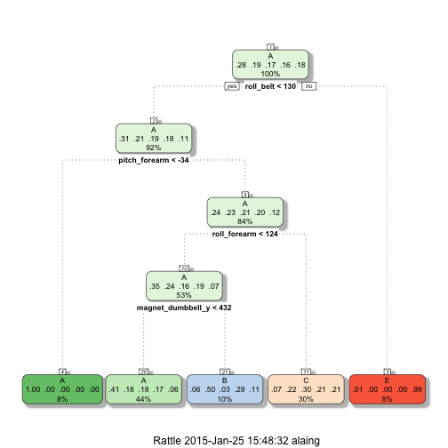

### Synopsis

Given a training dataset containing 19622 observations of 160 variables collected for Human Activity Recognition purpose, the goal is to predict the outcome for 20 observations contained in the test dataset.
In order to solve this problem we first perform an exploratory data analysis that shows that in the test dataset 100 columns contain only NAs, and therefore can be ignored. Further more 7 following variables:"X", "user_name", "raw_timestamp_part_1",  "raw_timestamp_part_2", "cvtd_timestamp", "new_window", "num_window" can also be ignored because they obviously are irrelevant. 
Having eliminated those 107 variables we perform a simple decision tree based classification. This classification yield about 49% accuracy. But allows us to  get the most important variables. We can then use only those 17 most important variables to perform a more accurate classifcation using the RandomForest algorithm.


#### Eliminate irrelevant columns, create data partition, training dataset and crossvalidation dataset,


```r
test1 =test[1,!is.na(test[1,])]
test1 <- test1[1,c(8:59)]
testUsable = test[,names(test) %in% names(test1)]
names =cbind(names(test1),"classe")
trainUsable=train[,names(train) %in% names]

indTrain =createDataPartition(trainUsable$classe,p=.6,list=FALSE)

traindata=trainUsable[indTrain,]
testdata=trainUsable[-indTrain,]
```


#### Perform a decision tree bases classification and get the most important variables.


#### The tree produced is:


```r
library(rattle)
library(rpart)
fancyRpartPlot(fitsimple$finalModel)
```

 


#### The accuracy for this classification is:


```r
accuracySimple 
```

```
## Accuracy 
## 0.482284
```

#### Given that the accuracy is so low we must perform the classification using more accurate algorithm. We retain only the variable with importance greater than zero. Using randomForest we expect out the of sample accuracy to be at least 95% (out of sample error rate less than 5%)


```r
varimp
```

```
## rpart variable importance
## 
##   only 20 most important variables shown (out of 52)
## 
##                   Overall
## pitch_forearm      100.00
## roll_belt           88.43
## roll_forearm        69.43
## magnet_dumbbell_y   67.40
## accel_belt_z        43.76
## magnet_belt_y       41.40
## total_accel_belt    36.13
## roll_dumbbell       33.64
## magnet_arm_x        27.92
## accel_arm_x         25.99
## yaw_belt            20.65
## accel_dumbbell_y    18.03
## magnet_dumbbell_z   15.64
## gyros_dumbbell_y     0.00
## gyros_belt_x         0.00
## accel_belt_x         0.00
## gyros_dumbbell_x     0.00
## magnet_belt_x        0.00
## magnet_arm_z         0.00
## magnet_belt_z        0.00
```

```r
importantColumns =  names(testdata[varimp[[1]]$Overall>0])
```

#### Perform randomForest classification using only the most important variables.


```r
namesImp = cbind(importantColumns,"classe")
traindata = traindata[,names(traindata) %in% namesImp]
testdata=testdata[,names(testdata) %in% namesImp]
fit= train(classe ~ . ,method="rf",data=traindata)
```

#### Accuracy of predictions and of out of sample error


```r
print(fit$finalModel)
```

```
## 
## Call:
##  randomForest(x = x, y = y, mtry = param$mtry) 
##                Type of random forest: classification
##                      Number of trees: 500
## No. of variables tried at each split: 7
## 
##         OOB estimate of  error rate: 8.33%
## Confusion matrix:
##      A    B    C    D    E class.error
## A 3098   85   87   56   22  0.07467145
## B   68 2068  106   32    5  0.09258447
## C   88  109 1777   74    6  0.13485881
## D   93   19   54 1758    6  0.08911917
## E   45   10   11    5 2094  0.03279446
```

```r
pred =predict(fit,newdata=testdata)
cfmat =confusionMatrix(testdata$classe,pred)
cfmat$overall[1]
```

```
##  Accuracy 
## 0.9171552
```

```r
preV=predict(fit,test)
outSampleError = sqrt(sum((pred-testdata$classe)^2))
```

```
## Warning in Ops.factor(pred, testdata$classe): '-' not meaningful for
## factors
```

#### The prediction yield by the classification:


```r
preV
```

```
##  [1] B A B A A E D B A A B C B A E E A B B C
## Levels: A B C D E
```

```r
outSampleError
```

```
## [1] NA
```


